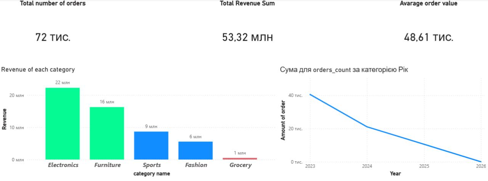

# Spark Medallion Data Pipeline 

This project implements a comprehensive **end-to-end ETL pipeline** leveraging Apache Spark deployed in Docker, following the **Medallion Architecture** principles.

## 📌 Project Overview
The pipeline automates the data lifecycle from raw data generation to final business intelligence. It simulates a production-grade big data environment where a Spark cluster (Master + Worker nodes) operates within isolated Docker containers.

**Key Stages:**
1.  **Generation:** A Python script generates synthetic datasets in JSON/CSV formats.
2.  **Infrastructure:** Automatic orchestration of the Spark cluster using Docker Compose.
3.  **Processing (Medallion Architecture):**
    * **Bronze:** Ingesting raw data into the primary landing zone.
    * **Silver:** Data cleaning, filtering, and schema validation (StructType).
    * **Gold:** Data aggregation and creation of business-level analytical marts.
4.  **Analytics:** Visualizing the processed insights in Power BI.

## 🏗 Architecture
()

## 🛠 Tech Stack
* **Language:** Python 3.x
* **Data Processing:** PySpark (Spark SQL & Core)
* **Containerization:** Docker, Docker Compose
* **Analytics & Visualization:** Power BI
* **Orchestration & Control:** PowerShell Scripts

## 📊 Power BI Analytics & Visualization

The final stage of the pipeline transforms the **Gold Layer** (aggregated business-ready data) into an interactive analytical dashboard. This allows for real-time monitoring of sales efficiency and geographical distribution.

### 🔍 Key Metrics & Insights:
1. **Total Orders:** A high-level KPI showing the total volume of processed transactions across all regions.
2. **Total Revenue:** Cumulative earnings aggregated from all product categories.
3. **Average Order Value (AOV):** A crucial business metric showing the mean revenue generated per single order.
4. **Revenue by Category (Dynamic Bar Chart):** A visualization of income distribution where colors change dynamically (Conditional Formatting) based on performance thresholds to highlight top-performing vs. underperforming categories.
5. **Order Volume Trend (Line Chart):** A temporal analysis demonstrating the growth and seasonality of order counts on a yearly basis.

---
### 🖼️ Dashboard Preview

## 📂 Project Structure
```bash
.
├── app/
│   ├── data_exploration/    # EDA and data analysis notebooks/scripts
│   ├── schemas/             # Spark StructType schema definitions
│   ├── utils/               # Logging and helper utilities
│   ├── main.py              # Data generator and process entry point
│   ├── raw_to_bronze.py     # ETL: Raw -> Bronze
│   ├── bronze_to_silver.py  # ETL: Bronze -> Silver
│   └── silver_to_gold.py    # ETL: Silver -> Gold
├── data/
│   ├── raw/                 # Incoming raw data files
│   ├── bronze/              # Bronze layer (Parquet/Delta format)
│   ├── silver/              # Silver layer (Cleaned data)
│   └── gold/                # Gold layer (Analytical tables)
├── spark-scripts/
│   ├── run_pipeline.ps1     # Main script to execute the full cycle
│   └── ...                  # Individual scripts for each stage
└── docker-compose.yml       # Spark Master & Worker configuration

